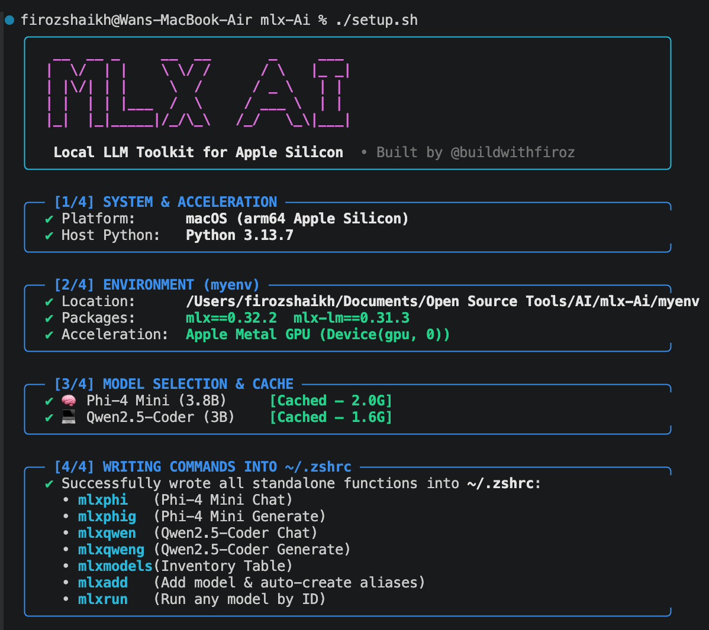

<h2 align="left" style="display: flex; align-items: center;">
  <svg width="38" height="38" viewBox="0 0 24 24" fill="#0071E3" xmlns="http://www.w3.org/2000/svg" style="margin-right: 12px;">
    <path d="M18.71 19.5c-.83 1.24-1.71 2.45-3.05 2.47-1.34.03-1.77-.79-3.29-.79-1.53 0-2 .77-3.27.82-1.31.05-2.3-1.32-3.14-2.53C4.25 17 2.94 12.45 4.7 9.39c.87-1.52 2.43-2.48 4.12-2.51 1.28-.02 2.5.87 3.29.87.78 0 2.26-1.07 3.81-.91.65.03 2.47.26 3.64 1.98-.09.06-2.17 1.28-2.15 3.81.03 3.02 2.65 4.03 2.68 4.04-.03.07-.42 1.44-1.38 2.83M15.97 6.37c.62-.75 1.04-1.8 1.01-2.87-.96.04-2.13.64-2.79 1.41-.58.68-.99 1.74-.92 2.8.03.01.07.01.1.01 1-.03 2-0.6 2.6-1.35z"/>
  </svg>
  Apple Silicon LLM: Native MLX Local AI Toolkit
</h2>

Apple Silicon LLM is an ***open-source*** toolkit that runs and manages high-performance local AI models natively on Apple Silicon Macs (M1/M2/M3/M4) using Apple's MLX framework. Built specifically for Apple hardware with zero cloud dependencies and 4-bit quantization, it stands out by being ***ultra-fast, 100% private, and extremely memory-efficient*** with instant terminal commands.

Built by **[@buildwithfiroz](https://github.com/buildwithfiroz)**.

<br>

-black?style=for-the-badge&logo=apple&logoColor=white) &nbsp; &nbsp;
 &nbsp; &nbsp;
 &nbsp; &nbsp;
 &nbsp; &nbsp;
 &nbsp; &nbsp;


<br>

---

## What Is This? (TL;DR)

**Apple Silicon LLM** is an open-source, one-click setup for running local AI language models on Apple Silicon Macs (M1, M2, M3, M4) using Apple's [MLX framework](https://github.com/ml-explore/mlx). It gives you:

- **Two production-ready 4-bit quantized models** — Phi-4 Mini (general reasoning) and Qwen2.5-Coder 3B (code generation) — that run entirely in unified memory on an 8 GB Mac.
- **Seven global shell commands** (`mlxphi`, `mlxphig`, `mlxqwen`, `mlxqweng`, `mlxmodels`, `mlxadd`, `mlxrun`) that handle virtual environment activation, model selection, and token limits automatically.
- **A single `setup.sh` script** with an interactive model picker menu, download progress tracking, and **automatic shell reload** — zero manual steps.

No Docker. No background daemons. No cloud API keys. No subscription fees. **Your prompts and code never leave your machine.**

---

## Quick Start — Zero to Local LLM in Under 2 Minutes

```bash
# 1. Clone the repository
git clone https://github.com/buildwithfiroz/apple-silicon-llm.git
cd apple-silicon-llm

# 2. Run the one-click setup
chmod +x setup.sh
./setup.sh
```

During setup, you will be prompted with an interactive menu to choose which models to download:


<p align="center">
  
</p>


> [!TIP]
> **Zero-Friction Automatic Shell Reload:**&#x57;hen setup finishes, it **automatically reloads your shell**. All commands are immediately active in your terminal — no manual `source ~/.zshrc` required!

```bash
# 3. Start using immediately!
mlxphi                                          # Interactive chat with Phi-4 Mini
mlxqweng "Write a Python decorator for retries" # One-shot code generation
mlxmodels                                       # View installed models & sizes
mlxadd                                          # Download any new Hugging Face model
mlxrun                                          # Interactive model & mode runner
```

---

## Table of Contents

- [Why This Project?](#why-this-project)
- [Features](#features)
- [Architecture & Execution Flow](#architecture--how-it-works)
- [Supported Hardware & Memory Budgeting](#supported-hardware--memory-budgeting)
- [Current Models vs. Tested Models](#current-models-vs-tested-models)
- [Installation & Reproducible Setup](#installation--reproducible-setup)
- [Daily Developer Workflow (Aliases)](#daily-developer-workflow-aliases)
- [Interactive Chat vs. One-Shot Generation](#interactive-chat-vs-one-shot-generation)
- [Model Inventory & Cache Inspection (`mlxmodels`)](#model-inventory--cache-inspection-mlxmodels)
- [Deep Dive: Hugging Face Cache on macOS](#deep-dive-the-hugging-face-cache-on-macos)
- [Understanding Caching (3 Layers Explained)](#understanding-caching-download-vs-memory-vs-kv-cache)
- [Quantization: What 4-Bit Actually Means](#quantization-what-4-bit-really-means)
- [Performance & Benchmark Observations](#performance--benchmark-observations)
- [Model Selection Guide (Which Model to Use)](#model-selection-guide)
- [Adding New Models](#adding-new-models)
- [Deleting Models & Freeing Disk Space](#deleting-models--freeing-disk-space)
- [MLX vs. Ollama: When to Use Which](#mlx-vs-ollama-a-technical-comparison)
- [Why Apple Silicon + MLX?](#why-apple-silicon--mlx)
- [Known Warnings & Compatibility Notes](#known-warnings--compatibility-notes)
- [Troubleshooting Guide](#troubleshooting-guide)
- [Security & Privacy](#security--privacy)
- [Project Structure](#project-structure)
- [FAQ](#frequently-asked-questions-faq)
- [Roadmap](#roadmap)
- [Contributing & License](#contributing--license)

---

## Why This Project?

Running Large Language Models locally gives you total privacy, zero latency variance, zero subscription costs, and the freedom to work completely offline. However, setting up local LLMs on Apple Silicon often leads developers into one of two frustrating situations:

1. **Heavyweight abstractions** (Docker containers, background daemons like Ollama): Opaque servers that consume system memory continuously, hide hardware-level metrics, and separate you from Apple Silicon's native compute layer.
2. **Raw Python friction**: Manually activating virtual environments, remembering 50-character Hugging Face repository identifiers (`mlx-community/Qwen2.5-Coder-3B-Instruct-4bit`), looking up argument flags every time, and debugging symlinked cache directories that report wrong sizes.

**This toolkit eliminates both problems.** Built on an M1 MacBook Air with 8 GB of RAM — the most constrained modern Apple Silicon Mac — it delivers a developer experience where running a local LLM is as simple as typing `mlxphi`.

### What makes this different

- **Direct Metal GPU acceleration** via Apple's official [MLX](https://github.com/ml-explore/mlx) framework — no translation layers, no emulation.
- **Extreme memory efficiency** using 4-bit quantized models that leave room for your browser, IDE, and macOS.
- **Sub-second developer ergonomics** with shell aliases that handle virtual environment activation, model paths, and token limits automatically.
- **Accurate model management** that correctly resolves Hugging Face symlinks to show real disk sizes, not misleading 6 MB metadata.
- **100% portable** — zero hardcoded filesystem paths. Clone it anywhere, run `setup.sh`, done.

---

## Features

- **Native Apple Silicon GPU execution** via MLX with Metal — zero CUDA emulation or CPU fallback
* **4-bit quantized models** from `mlx-community` providing \~75% weight compression vs FP16
- **Interactive terminal chat** (`mlxphi`, `mlxqwen`) with multi-turn conversation history
- **One-shot shell generation** (`mlxphig`, `mlxqweng`) with Unix pipe compatibility for scripting
- **Dynamic path architecture** — all shell functions resolve paths at runtime, no hardcoded `/Users/...`
- **Real-size model inventory** (`mlxmodels`) that follows symlinks to report true on-disk weight sizes
- **Built-in cache management** via `mlx_lm.manage` for inspection and clean model removal
- **100% offline inference** after initial model download — prompts never leave your machine
- **One-click automated setup** (`setup.sh`) with platform validation, GPU verification, download progress, and `.zshrc` integration
- **Model download progress feedback** — clear status for each model during setup, not a silent background process

---

## Architecture & How It Works

```
+-------------------------------------------------------------------------+
|                              DEVELOPER                                  |
|         Terminal: mlxphi · mlxphig · mlxqwen · mlxqweng · mlxmodels     |
+------------------------------------+------------------------------------+
                                     |
                                     v
+------------------------------------+------------------------------------+
|                         SHELL ALIAS LAYER (setup.sh)                    |
|   - Dynamically resolves REPO_DIR (zero hardcoded paths)                |
|   - Activates isolated venv: myenv/bin/activate                         |
|   - Routes to mlx_lm.chat or mlx_lm.generate with model + flags        |
+------------------------------------+------------------------------------+
                                     |
                                     v
+------------------------------------+------------------------------------+
|                       MLX-LM INFERENCE ENGINE                           |
|   - Loads tokenizer & chat template from Hugging Face config            |
|   - Prompt prefill (parallel) → Autoregressive token decode (serial)    |
+------------------------------------+------------------------------------+
                                     |
                                     v
+------------------------------------+------------------------------------+
|                          APPLE MLX FRAMEWORK                            |
|   - mx.array: zero-copy unified memory arrays                           |
|   - Lazy graph evaluation → Metal shader dispatch                       |
|   - Custom 4-bit affine dequantization + matmul kernels                 |
+------------------------------------+------------------------------------+
                                     |
                                     v
+------------------------------------+------------------------------------+
|                    APPLE SILICON HARDWARE                                |
|   +-----------------------------------------------------------------+   |
|   |            Unified Memory (8 GB / 16 GB / 24 GB+)              |   |
|   |   System + Apps + Model Weights + KV Cache + Working Buffers    |   |
|   +-----------------------------------------------------------------+   |
|   |            Metal GPU Cores (Shared Memory Bandwidth)            |   |
|   +-----------------------------------------------------------------+   |
+-------------------------------------------------------------------------+
```

### How Each Layer Works

| Layer | What It Does |
| :--- | :--- |
| **Shell Alias** | You type `mlxphi`. The function activates `myenv`, passes the Hugging Face model ID and `--max-tokens 8192` to MLX-LM. |
| **MLX-LM Engine** | Loads tokenizer configs, applies chat templates, manages the prefill/decode loop, handles sampling (temperature, top-p). |
| **Apple MLX** | Builds lazy computation graphs, dispatches Metal shaders to the GPU, manages memory via Apple's unified memory allocator. |
| **Metal Hardware** | Executes optimized GPU kernels for 4-bit weight dequantization and matrix multiplication on the shared memory bus. |

---

## Supported Hardware & Memory Budgeting

### Tested Hardware: MacBook Air M1, 8 GB RAM

This toolkit was built and tested on the **most constrained modern Apple Silicon Mac** — proving that practical local LLM inference doesn't require expensive hardware:

| Specification | Value |
| :--- | :--- |
| **Chip** | Apple M1 |
| **Memory** | 8 GB Unified (LPDDR4X, 68.25 GB/s bandwidth) |
| **CPU** | 8-core (4P + 4E) |
| **GPU** | 7/8-core Metal |
| **Cooling** | Fanless (passive thermal) |
| **OS** | macOS Sonoma / Sequoia |

### Understanding Apple's Unified Memory Architecture (UMA)

Unlike traditional PCs where CPU RAM and GPU VRAM are physically separate memory pools connected by a PCIe bus, Apple Silicon uses a **single shared memory pool**. The CPU, GPU, and Neural Engine all read from and write to the same physical DRAM:

​$\text{Available for LLM} = \text{Total RAM} - \text{macOS} - \text{User Apps}$​

On an 8 GB machine:

```
 8 GB Unified Memory Budget
+-------------------+-------------------+---------------------------+
|  macOS System     |  Active Apps      |  Available for LLM        |
|  (~2.0 - 2.5 GB)  |  (~1.5 - 2.0 GB)  |  (~3.5 - 4.0 GB)          |
+-------------------+-------------------+---------------------------+
                                        |
                       +----------------+------------------+
                       | 4-Bit Weights  |  KV Cache Buffer |
                       | (1.6 - 2.0 GB) |  (~0.3 - 0.8 GB) |
                       +----------------+------------------+
```

### Which Models Fit on Which Mac

| Apple Silicon Configuration | Recommended Model Size | Experience |
| :--- | :--- | :--- |
| **M1/M2/M3/M4 (8 GB)** | **1.5B – 3.8B (4-bit)** | Fast, fully in-memory, no swapping |
| **M-Series (16 GB – 24 GB)** | **7B – 14B (4-bit)** | Smooth multitasking, larger context windows |
| **M-Series Pro (18 GB – 36 GB)** | **14B – 32B (4-bit)** | Complex reasoning, large codebases |
| **M-Series Max / Ultra (36 GB – 192 GB)** | **32B – 70B+ (4-bit / 8-bit)** | Research-grade, full-precision experimentation |

---

## Current Models vs. Tested Models

### Active Models (Configured in `setup.sh`)

These are the two production models that ship with aliases:

| Model | Architecture | Quantization | Disk Size | Peak RAM | Context | Use Case | Chat | Generate |
| :--- | :--- | :---: | :---: | :---: | :---: | :--- | :---: | :---: |
| **Phi-4 Mini Instruct** | `phi3` | 4-bit | **2.0 GB** | \~2.3 GB | 8,192 | General reasoning, Q\&A, logic | `mlxphi` | `mlxphig` |
| **Qwen2.5-Coder 3B Instruct** | `qwen2` | 4-bit | **1.6 GB** | \~1.9 GB | 8,192 / 4,096 | Code generation, refactoring | `mlxqwen` | `mlxqweng` |

> [!IMPORTANT]
> **Disk size ≠ runtime memory.**&#x44;isk size is the compressed weight file on your SSD. Runtime memory additionally includes model activations, tokenizer state, and the KV attention cache. Expect peak RAM to be **\~0.3–0.6 GB higher** than disk size.

### Tested During Development (Not Actively Configured)

These models were benchmarked on the M1 8 GB testbed during development:

| Model | Quant | Peak RAM | Prefill | Generation | Status |
| :--- | :---: | :---: | :---: | :---: | :--- |
| **Qwen2.5-Coder 1.5B** | 4-bit | \~0.95 GB | \~128.5 tok/s | \~26.0 tok/s | Ultra-fast but weaker at complex logic. Removed to simplify defaults. |
| **Qwen2.5-Coder 7B** | 4-bit | \~4.4 GB | \~5.5 tok/s | \~5.7 tok/s | Strong coding but causes swap on 8 GB Macs. Best for 16 GB+. |
| **gemma-4-e2b-it-4bit** | 4-bit | \~1.4 GB | Experimental | Experimental | Evaluated; Phi-4 Mini and Qwen 3B were retained as superior defaults. |

---

## Installation & Reproducible Setup

### Prerequisites

- macOS 13.0+ (Ventura, Sonoma, or Sequoia)
- Apple Silicon Mac (M1, M2, M3, or M4 — any variant)
- Python 3.10+ (recommended: `brew install python@3.13`)
- Git

---

### Option A: Automated One-Click Setup (Recommended)

```bash
git clone <YOUR_REPOSITORY_URL>
cd mlx-Ai
chmod +x setup.sh
./setup.sh
source ~/.zshrc
```

**What `setup.sh` does automatically:**

| Step | Action |
| :--- | :--- |
| 1 | Validates macOS + Apple Silicon (`arm64`) |
| 2 | Checks Python 3.10+ |
| 3 | Creates `myenv` virtual environment |
| 4 | Installs `mlx-lm` and all dependencies |
| 5 | Verifies Apple Silicon Metal GPU (`Device(gpu, 0)`) |
| 6 | Offers to download models with real-time progress feedback |
| 7 | Links shell aliases into `~/.zshrc` (idempotent — safe to re-run) |

#### Setup Flags

| Flag | Behavior |
| :--- | :--- |
| `./setup.sh --download-models` | Downloads both models automatically (no prompt) |
| `./setup.sh --skip-models` | Skips model downloads; they'll download on first use |
| `./setup.sh --aliases-only` | Only loads aliases (used by `.zshrc` source line) |

---

### Option B: Manual Step-by-Step Setup

```bash
# 1. Clone repository
git clone <YOUR_REPOSITORY_URL>
cd mlx-Ai

# 2. Create virtual environment
python3 -m venv myenv
source myenv/bin/activate

# 3. Install dependencies
pip install --upgrade pip
pip install -r requirements.txt
# Or: pip install -U mlx-lm

# 4. Verify GPU detection
python -c "import mlx.core as mx; print('MLX Device:', mx.default_device())"
# Expected: MLX Device: Device(gpu, 0)

# 5. Test a model
mlx_lm.generate --model mlx-community/Phi-4-mini-instruct-4bit --prompt "Hello" --max-tokens 10
```

---

## Daily Developer Workflow (Aliases)

Instead of typing:
```bash
source ~/path/to/mlx-Ai/myenv/bin/activate && mlx_lm.generate --model mlx-community/Qwen2.5-Coder-3B-Instruct-4bit --max-tokens 4096 --prompt "..."
```

You type:
```bash
mlxqweng "Write a Go HTTP server with graceful shutdown"
```

### All Available Commands (Work from Anywhere on Your Mac)

| Command | Mode | What It Does |
| :--- | :---: | :--- |
| `mlxphi` | Chat | Interactive multi-turn chat with **Phi-4 Mini** (4-bit) |
| `mlxphig "prompt"` | Generate | One-shot generation with **Phi-4 Mini** (4-bit) |
| `mlxqwen` | Chat | Interactive multi-turn chat with **Qwen2.5-Coder 3B** (4-bit) |
| `mlxqweng "prompt"` | Generate | One-shot code generation with **Qwen2.5-Coder 3B** (4-bit) |
| `mlxmodels` | Inventory | Dynamic table of all cached models, real disk sizes, and shortcuts |
| `mlxadd <model-id>` | Tool | Download any HF model & **auto-generate its shortcuts** in `~/.zshrc` |
| `mlxrun <model> "prompt"` | Flexible | Run any model by Hugging Face repo ID (`--chat` or one-shot) |

### How the Shortcuts Are Installed in `~/.zshrc`

When you run `setup.sh`, it writes the **actual standalone shell functions directly into your `~/.zshrc`** using your machine's absolute paths:

```bash
# Chat with Phi-4 Mini (3.8B)
mlxphi() {
    source "/path/to/mlx-Ai/myenv/bin/activate"
    mlx_lm.chat --model mlx-community/Phi-4-mini-instruct-4bit --max-tokens 8192 "$@"
}

# One-shot prompt with Phi-4 Mini (3.8B)
mlxphig() {
    source "/path/to/mlx-Ai/myenv/bin/activate"
    mlx_lm.generate --model mlx-community/Phi-4-mini-instruct-4bit --max-tokens 8192 --prompt "$*"
}

# Chat with Qwen2.5-Coder (3B)
mlxqwen() {
    source "/path/to/mlx-Ai/myenv/bin/activate"
    mlx_lm.chat --model mlx-community/Qwen2.5-Coder-3B-Instruct-4bit --max-tokens 8192 "$@"
}

# One-shot code generation with Qwen2.5-Coder (3B)
mlxqweng() {
    source "/path/to/mlx-Ai/myenv/bin/activate"
    mlx_lm.generate --model mlx-community/Qwen2.5-Coder-3B-Instruct-4bit --max-tokens 4096 --prompt "$*"
}
```

Because the full path is hardcoded directly into each function in your `~/.zshrc`, these commands **work from any folder, any tab, anywhere on your MacBook** — you never have to `cd` into the repository or manually activate the virtual environment.

### Adding New Models Dynamically (`mlxadd`)

When you run:
```bash
mlxadd mlx-community/Llama-3.2-3B-Instruct-4bit
```
It downloads the model AND **automatically appends new dedicated shortcuts directly into your `~/.zshrc`**:
- `mlxllama`: Interactive chat
- `mlxllamag "prompt"`: One-shot generation

The new shortcuts become active immediately in your shell session!

---

## Interactive Chat vs. One-Shot Generation

| Feature | Chat (`mlxphi` / `mlxqwen`) | Generate (`mlxphig` / `mlxqweng`) |
| :--- | :--- | :--- |
| **MLX-LM Command** | `mlx_lm.chat` | `mlx_lm.generate` |
| **Interface** | Interactive REPL with `>>` prompt | Single stdout output, then exit |
| **Context** | Multi-turn; remembers previous messages | Stateless; one prompt → one response |
| **Best For** | Debugging, architecture, pair programming | Scripts, piping, automation, quick answers |
| **Scriptability** | Requires PTY/stdin automation | Native Unix pipes: `echo "..." \| mlxphig` |

### Practical Examples

```bash
# Generate code and copy to clipboard
mlxqweng "Write a Python retry decorator with exponential backoff" | pbcopy

# Pipe a git diff for AI-powered review
git diff | mlxphig "Summarize the breaking changes in this diff"

# Generate a file directly
mlxqweng "Write a Dockerfile for a Python FastAPI app" > Dockerfile

# Quick one-liner answers
mlxphig "What is the difference between a mutex and a semaphore?"
```

---

## Model Inventory & Cache Inspection (`mlxmodels`)

The `mlxmodels` command gives you an instant overview of all cached models, their real disk sizes, and the aliases to use them:

```
$ mlxmodels

╔═══════════════════════════════════════════════════════════════════╗
║                      MLX LOCAL MODELS                           ║
║                      @buildwithfiroz                            ║
╚═══════════════════════════════════════════════════════════════════╝

  MODEL                  SIZE       CHAT         GENERATE
  ────────────────────── ────────── ──────────── ────────────
  Phi-4 Mini             2.0G       mlxphi       mlxphig
  Qwen Coder 3B          1.6G       mlxqwen      mlxqweng

  Tip: 'mlx_lm.manage --scan' shows full Hugging Face cache details.
```

**How `mlxmodels` calculates real sizes:** It runs `du -shL` (the `-L` flag follows symlinks) on each model's `snapshots/` directory, resolving the underlying `blobs/` where the actual weight data lives. This is critical because a naive `du -sh` on the model directory would report only **\~6 MB** (the symlink metadata), not the real **2.0 GB** of weights.

### Deep Inventory via `mlx_lm.manage`

For full Hugging Face cache diagnostics, use the built-in management tool:

```bash
source myenv/bin/activate && mlx_lm.manage --scan
```

---

## Deep Dive: The Hugging Face Cache on macOS

### Where Models Are Stored

```text
~/.cache/huggingface/hub/
```

### The Symlink + Blob Architecture

Hugging Face uses content-addressable storage — model files are stored as hashed blobs, referenced by symlinks:

```text
~/.cache/huggingface/hub/
├── blobs/                          ← Actual weight data (content-addressed by SHA-256)
│   ├── 9dcfcdc0a579...  (2.0 GB)  ← Phi-4 Mini safetensors weights
│   └── af52cde61cc3...  (4.2 KB)  ← Config metadata
└── models--mlx-community--Phi-4-mini-instruct-4bit/
    ├── snapshots/
    │   └── 3e29f3d.../             ← Human-readable names, but just symlinks!
    │       ├── config.json       → ../../blobs/b737364...
    │       ├── tokenizer.json    → ../../blobs/382cc23...
    │       └── model.safetensors → ../../blobs/9dcfcdc...  (→ 2.0 GB blob)
    └── refs/
        └── main
```

### Why `du -sh` Lies About Model Sizes

```bash
# Without -L: reports symlink metadata only (~6 MB)
$ du -sh ~/.cache/huggingface/hub/models--mlx-community--Phi-4-mini-instruct-4bit
6.2M

# With -L: follows symlinks to report actual weight data (~2.0 GB)
$ du -shL ~/.cache/huggingface/hub/models--mlx-community--Phi-4-mini-instruct-4bit/snapshots
2.0G
```

This is why `mlxmodels` uses `du -shL` — to give you the truth.

---

## Understanding Caching (Download vs. Memory vs. KV Cache)

There are **three distinct caching layers** in local LLM inference. Understanding the difference is key to debugging performance:

```
┌─────────────────────────────────────────────────────────────────────┐
│  Layer 1: DISK CACHE (Hugging Face Hub)                            │
│  • Model weights stored as files on SSD                            │
│  • Persists permanently until you delete them                      │
│  • Prevents re-downloading gigabytes each run                      │
├─────────────────────────────────────────────────────────────────────┤
│  Layer 2: PROCESS MEMORY (Unified RAM)                             │
│  • Weights loaded into GPU-accessible memory when model starts     │
│  • Stays resident during mlxphi chat sessions                      │
│  • Freed when the process exits (e.g., after mlxphig completes)    │
├─────────────────────────────────────────────────────────────────────┤
│  Layer 3: KV ATTENTION CACHE (Compute Buffer)                      │
│  • Stores pre-computed attention keys & values for past tokens     │
│  • Eliminates O(N²) re-computation in multi-turn conversations     │
│  • Can be serialized to disk via --prompt-cache-file                │
└─────────────────────────────────────────────────────────────────────┘
```

### Key Insight

> **"Why was the second message faster, but restarting the command was slow?"**

### What Is the KV Cache?

During transformer self-attention, each token computes query ($Q$), key ($K$), and value ($V$) projections. For token $N+1$, the keys and values for tokens $1 \dots N$ don't change — so they're cached in memory instead of being recomputed. This is the KV cache.

MLX-LM supports persisting this cache to disk with `--prompt-cache-file`, allowing you to warm up an expensive system prompt once and reuse it across sessions.

---

## Quantization: What 4-Bit Really Means

### The Compression

Standard LLM weights are trained in 16-bit floating point (FP16/BF16) — **2 bytes per parameter**. A 3-billion parameter model in FP16:

​$3 \times 10^9 \text{ params} \times 2 \text{ bytes} = 6.0 \text{ GB}$​

In **4-bit quantization**, each parameter is compressed to just **0.5 bytes** using affine scaling with group-level scale/zero-point factors:

​$3 \times 10^9 \times 0.5 \text{ bytes} + \text{scales} \approx 1.6 \text{ GB}$​

That's a **\~75% memory reduction**.

> [!NOTE]
> **"4-bit" ≠ 4 Gigabytes.**"4-bit" is the **bit-width per parameter**. A 1.5B model in 4-bit is \~0.95 GB. A 3B model is \~1.6 GB. A 7B model is \~4.4 GB. The term refers to precision, not size.

### Why 4-Bit Matters on Apple Silicon

LLM token generation is **memory bandwidth bound**. Each generated token requires streaming every weight through the compute units. Reducing weights from 16-bit to 4-bit cuts the memory bandwidth required by 4×, directly translating to faster token generation on memory-bandwidth-limited Apple Silicon chips.

---

## Performance & Benchmark Observations

Real development measurements on the **M1 MacBook Air (8 GB RAM)**:

| Model | Quant | Peak RAM | Prefill Speed | Generation Speed | Usability |
| :--- | :---: | :---: | :---: | :---: | :--- |
| **Qwen2.5-Coder 1.5B** | 4-bit | \~0.95 GB | \~128.5 tok/s | \~26.0 tok/s | Instantaneous. Typing speed. |
| **Qwen2.5-Coder 3B** | 4-bit | \~1.9 GB | \~60.0 tok/s | \~18.5 tok/s | Fast. Smooth interactive coding. |
| **Phi-4 Mini (3.8B)** | 4-bit | \~2.3 GB | \~45.0 tok/s | \~12.9 tok/s | Responsive. Strong logical reasoning. |
| **Qwen2.5-Coder 7B** | 4-bit | \~4.4 GB | \~5.5 tok/s | \~5.7 tok/s | Slow on 8 GB. Swap pressure. |

> [!WARNING]
> **These are development observations, not formal benchmarks.**&#x54;oken rates vary significantly based on prompt length, output length, temperature settings, thermal throttling (fanless M1 Air), memory pressure from other applications, and MLX-LM version.

---

## Model Selection Guide

### When to Use Phi-4 Mini (`mlxphi` / `mlxphig`)

* General-purpose reasoning and Q\&A
- Explaining code, concepts, or architecture decisions
- Multi-turn conversations and debates
- Writing documentation, emails, or technical summaries

### When to Use Qwen2.5-Coder 3B (`mlxqwen` / `mlxqweng`)

- Generating functions, classes, or modules
- Code refactoring and optimization suggestions
- Shell script generation
- Language-specific code (Python, Go, Rust, TypeScript, SQL)

### Why These Two Were Chosen

| Criterion | Phi-4 Mini | Qwen 3B |
| :--- | :--- | :--- |
| **Strength** | Broad reasoning | Focused coding |
| **RAM headroom on 8 GB** | \~1.7 GB free | \~2.1 GB free |
| **Generation speed (M1)** | \~12.9 tok/s | \~18.5 tok/s |
| **Architecture** | Microsoft Phi-3 | Alibaba Qwen2 |

Together, they cover the two primary use cases (reasoning + coding) while both fitting comfortably within 8 GB unified memory.

---

## Adding New Models

Any model from [Hugging Face mlx-community](https://huggingface.co/mlx-community) can be added instantly:

### Option A: The One-Command Way (`mlxadd`)

The easiest way is to use the built-in `mlxadd` command:

```bash
# Interactive mode (presents suggestions and prompts for model ID):
mlxadd

# Or direct mode:
mlxadd mlx-community/Llama-3.2-3B-Instruct-4bit
```

Once downloaded, you can run it immediately with `mlxrun`:

```bash
# Run interactive chat:
mlxrun --chat mlx-community/Llama-3.2-3B-Instruct-4bit

# Run one-shot generation:
mlxrun mlx-community/Llama-3.2-3B-Instruct-4bit "Explain recursion in one sentence"

# Or just type mlxrun to pick from an interactive menu of all your models:
mlxrun
```

---

### Option B: Adding a Dedicated Custom Alias in `setup.sh`

If you want a permanent dedicated alias (like `mlxllama` and `mlxllamag`):

```bash
# 1. Add aliases to setup.sh (in the SHELL ALIASES section)
mlxllama() {
    local base_dir
    base_dir="$(_mlx_check_env)" || return 1
    source "$base_dir/myenv/bin/activate"
    mlx_lm.chat --model mlx-community/Llama-3.2-3B-Instruct-4bit --max-tokens 8192 "$@"
}

mlxllamag() {
    local base_dir
    base_dir="$(_mlx_check_env)" || return 1
    source "$base_dir/myenv/bin/activate"
    mlx_lm.generate --model mlx-community/Llama-3.2-3B-Instruct-4bit --max-tokens 4096 --prompt "$*"
}

# 2. Reload shell
source ~/.zshrc
```

### Tips for Choosing Models

- Look for models ending in `-4bit` for maximum memory efficiency
- Models from `mlx-community` are pre-converted for MLX — no conversion step needed
- On 8 GB Macs, stick to models ≤ 3.8B parameters in 4-bit quantization
- Always test memory usage before committing to a model as a default

---

## Deleting Models & Freeing Disk Space

### Method 1: Using `mlx_lm.manage` (Recommended)

```bash
source myenv/bin/activate
mlx_lm.manage --delete --pattern "Phi-4-mini"
```

### Method 2: Manual Deletion

```bash
rm -rf ~/.cache/huggingface/hub/models--mlx-community--Phi-4-mini-instruct-4bit
```

> [!TIP]
> **Clean orphaned blobs** after manual deletion:
>
> ```

---

## MLX vs. Ollama: A Technical Comparison

| Dimension | MLX / MLX-LM (This Toolkit) | Ollama |
| :--- | :--- | :--- |
| **Architecture** | Native Python/C++/Metal framework by Apple | Go daemon wrapping `llama.cpp` with HTTP API |
| **Hardware Coupling** | Deep Metal integration, zero-copy UMA | Metal via ggml kernels in `llama.cpp` |
| **Weight Format** | Hugging Face `safetensors` | GGUF binary blobs |
| **Process Model** | Ephemeral per command / Python-scriptable | Persistent daemon on `localhost:11434` |
| **Control** | Full — sampling code, KV cache, LoRA adapters | High-level via Modelfiles and API |
| **Model Ecosystem** | Hugging Face Hub (`mlx-community`) | Ollama model registry |
| **Fine-Tuning** | Native LoRA/QLoRA training built in | Inference only |

**Why MLX for this project:** Direct access to Apple Silicon compute without daemon overhead, native Python fine-tuning capability, and fine-grained control over prompt caching, context length, and token sampling.

Both tools are excellent. They can coexist on the same Mac without conflicts.

---

## Why Apple Silicon + MLX?

Apple MLX is purpose-built for Apple Silicon's unified memory architecture (UMA). Here's what makes the combination powerful for local LLM inference:

| Feature | How It Helps Local LLMs |
| :--- | :--- |
| **Unified Memory** | CPU and GPU share the same physical RAM — no PCIe bottleneck copying weights between host and device memory. |
| **Metal GPU** | Custom compute shaders for matrix ops. MLX compiles specialized 4-bit dequantization kernels at runtime. |
| **High Bandwidth** | 68–800+ GB/s memory bandwidth (varies by chip) directly feeds the GPU's matrix multiplication units. |
| **Lazy Evaluation** | MLX builds computation graphs lazily, evaluating only when results are needed — reducing peak memory. |
| **Zero-Copy Arrays** | `mx.array` objects live in unified memory. No `tensor.to(device)` copying required. |

---

## Known Warnings & Compatibility Notes

### RoPE Scaling Warning (Phi-4 Mini)

When loading `mlx-community/Phi-4-mini-instruct-4bit`, you'll see:

```text
[transformers] This model config has set a `rope_parameters['original_max_position_embeddings']`
field... Please set the `factor` field of `rope_parameters` with this ratio instead...
```

**This is a harmless deprecation notice** from Hugging Face `transformers` (v5.x). Microsoft's Phi-3/Phi-4 configs use an older RoPE schema. It does not affect inference quality, accuracy, or performance. The model loads and runs correctly.

### Metal Shader Compilation (First Launch Only)

On the very first run, Apple's Metal compiler compiles GPU shaders for your specific chip. This adds \~2–5 seconds. Subsequent launches reuse the compiled shader cache.

---

## Troubleshooting Guide

### `mlx_lm: command not found`
The virtual environment isn't active. Use the aliases (`mlxphi`, `mlxqwen`) which auto-activate, or manually run `source myenv/bin/activate`.

### `RuntimeError: [metal::Device] Unable to build metal library`
Metal needs write access to macOS shader cache (`/var/folders/...`). Run in a native terminal, not inside a sandboxed container.

### Model is very slow or system freezes
Memory pressure. On 8 GB, avoid 7B+ models with heavy apps open. Use `mlxmodels` to check your model sizes. Monitor memory in Activity Monitor (keep the graph green).

### `du -sh` reports tiny model size (\~6 MB)

Expected — Hugging Face uses symlinks. Run `mlxmodels` for real sizes, or use `du -shL` to follow symlinks.

### Aliases don't work after setup
```bash
source ~/.zshrc
```
If that doesn't help, verify the `# >>> mlx-ai aliases >>>` block exists in `~/.zshrc`.

### `Operation not permitted` when writing `~/.zshrc`
Add manually:
```bash
export MLX_AI_DIR="/path/to/mlx-Ai"
source "$MLX_AI_DIR/setup.sh" --aliases-only
```

---

## Security & Privacy

- **Zero network egress during inference.** When running `mlxphi`, `mlxqwen`, or any generation command, your prompts, source code, and outputs **stay entirely on your Mac**. No data is sent to external servers.
- **Air-gapped operation.** After model weights are cached, you can disconnect from the internet entirely. Inference works offline.
- **Model provenance.** Models are downloaded from Hugging Face Hub (`mlx-community`). Verify model sources before use.
- **Safe weight format.** Weights use `safetensors`, which prevents arbitrary code execution (unlike Python `pickle`).
- **Generated code caution.** Never execute AI-generated code blindly. Review all output before running.

---

## Project Structure

```text
.
├── setup.sh           # One-click installer + all shell aliases (mlxphi, mlxqwen, mlxmodels, etc.)
├── requirements.txt   # Pinned dependencies: mlx==0.32.2, mlx-lm==0.31.3, transformers==5.17.0
├── .gitignore         # Ignores myenv/, build artifacts, .DS_Store
└── README.md          # This documentation
```

---

## Frequently Asked Questions (FAQ)

**Q: Is this macOS only?**
Yes. Apple MLX requires macOS and Apple Silicon. It does not run on Linux, Windows, or Intel Macs.

**Q: Does it work on M2, M3, or M4?**
Yes — all Apple Silicon generations are supported. Newer chips offer higher memory bandwidth and faster generation.

**Q: Can I run inference completely offline?**
Yes. Once model weights are cached in `~/.cache/huggingface/hub/`, zero internet is needed for inference.

**Q: How much RAM do I need?**
8 GB is the minimum for the default 4-bit models. 16 GB is recommended for 7B+ models.

**Q: Can I use Ollama alongside MLX?**
Yes, they don't conflict. But if Ollama's daemon holds a model in memory, it competes for unified memory.

**Q: How do I change temperature or max tokens?**
Pass flags directly: `mlxphi --temp 0.2 --max-tokens 2048`

**Q: Can I run multiple models simultaneously?**
Each process loads one model. Running two `mlx_lm.chat` processes concurrently is possible but will consume memory for both sets of weights.

**Q: Where are models stored on disk?**
`~/.cache/huggingface/hub/` — managed automatically by Hugging Face Hub.

**Q: Does MLX use the Neural Engine (ANE)?**
MLX uses the Metal GPU cores, not the ANE. GPU provides the memory bandwidth and float precision needed for LLM matrix operations.

---

## Roadmap

- [ ] **Automated model discovery** — enhance `mlxmodels` to auto-detect any `mlx-community` model in the cache
- [ ] **Prompt cache workflows** — CLI commands to pre-generate and reuse KV cache files for system prompts
- [ ] **Local benchmark reporter** — built-in script to measure tok/s and peak memory on your specific hardware
- [ ] **OpenAI-compatible local API** — alias for `mlx_lm.server` to connect IDE plugins (Continue, Cursor, Copilot alternatives)
- [ ] **Model registry in config file** — YAML/JSON model registry instead of hardcoded shell functions

---

## Contributing & License

Contributions, bug reports, and hardware benchmark submissions from any Apple Silicon configuration are welcome!

### How to Contribute

1. Fork the repository
2. Create a feature branch (`git checkout -b feature/new-model`)
3. Test on native Apple Silicon hardware
4. Document model name, disk size, peak memory, and tok/s
5. Open a Pull Request

### License

> **Note:** A license file has not yet been selected for this repository. An open-source license such as **MIT** or **Apache-2.0** should be applied before public distribution.

---

Built with care by [[buildwithfiroz](mention:buildwithfiroz)]()​

  Making local AI practical on Apple Silicon.
